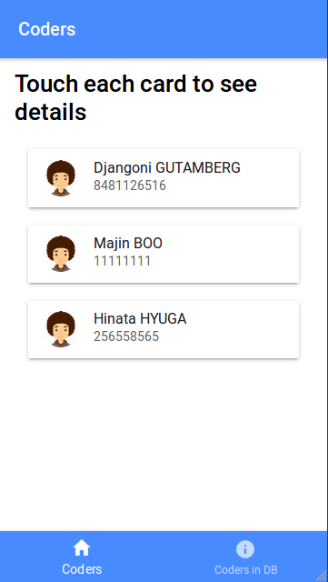

# CREATE LOCAL API AND GET DATAS FROM IONIC APP - EXAMPLE

## PART 2 : Get datas from Ionic App

## Prerequisites
Make sure you've installed :
- Node.js
- Cordova and Ionic command-line tools

## How to run it ?
- Download this repo and extract files or just clone this repository
- Install dependancies : open your terminal, move to the repo on your computer and run the command :
```
npm install
```
- Run the ionic app : When the terminal operations will end, run the command : 
```
ionic serve
```
- When app will run on your browser, go to tab Coders.
If you see the following image, so it's fine !


## Remark
I used Http module in the app but it's depreciated since the latest version of Angular.js (I'm talking abot version 5.0). If you can, I recommand you to use the HttpClient module if you're using the last version of Ionic wichs support Angular 5.